# 节点控制功能文档

## 目录

- [功能概述](#功能概述)
- [准备工作](#准备工作)
- [快速开始](#快速开始)
- [覆写节点详解](#覆写节点详解)
- [高级节点覆写操作](#高级节点覆写操作)

---

## 功能概述

### 什么是节点控制功能？

本插件提供了详细的控制节点输入的功能，允许你在使用 ComfyUI 工作流时动态覆写和定制参数。

### 为什么需要这个功能？

ComfyUI 导出的工作流 JSON 文件中，参数通常是固定死的（如种子、分辨率、步数等）。通过本功能，你可以：

- 选择哪些参数可以动态修改
- 在运行时重新输入分辨率、步数、提示词等参数
- 为不同场景配置不同的默认参数
- 实现更灵活的工作流调用方式

例如：一个固定的工作流文件可能设置了 512x512 的分辨率，但通过节点覆写功能，你可以在运行时将其修改为 768x768 或其他尺寸。

---

## 准备工作

在使用节点控制功能之前，需要完成以下准备工作：

### 1. 准备 API 格式的 JSON 工作流文件

#### 步骤一：确保工作流包含输出节点

对于图片工作流，必须包含一个 **Save Image** 或 **Preview Image** 节点来输出结果。

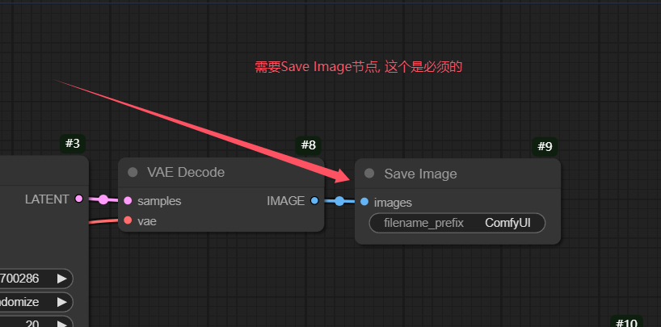

#### 步骤二：导出 API 格式的 JSON 文件

在 ComfyUI 界面中：

1. 点击菜单栏的 "Save (API Format)"
2. 选择保存位置
3. 保存为 JSON 格式文件

  
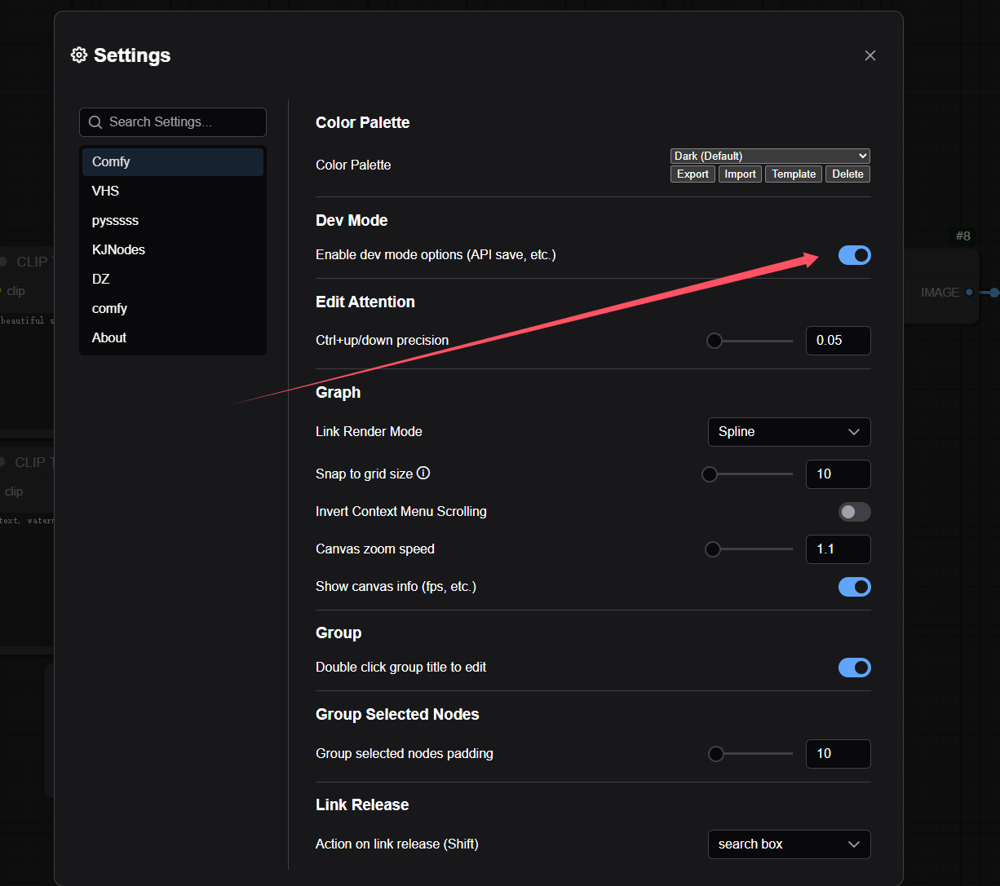  
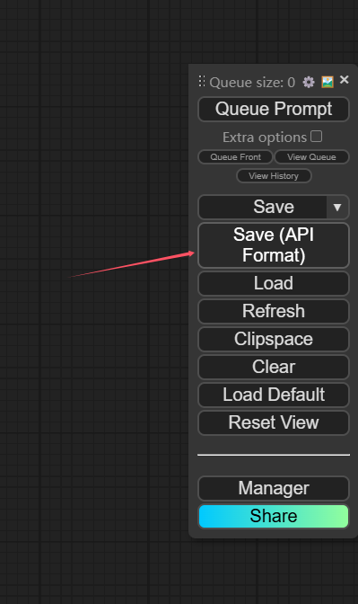

> ⚠️ **重要提示**：导出的 JSON 文件中，**output 节点必须连接到 SaveImage 节点**，这是插件正常工作的必要条件。

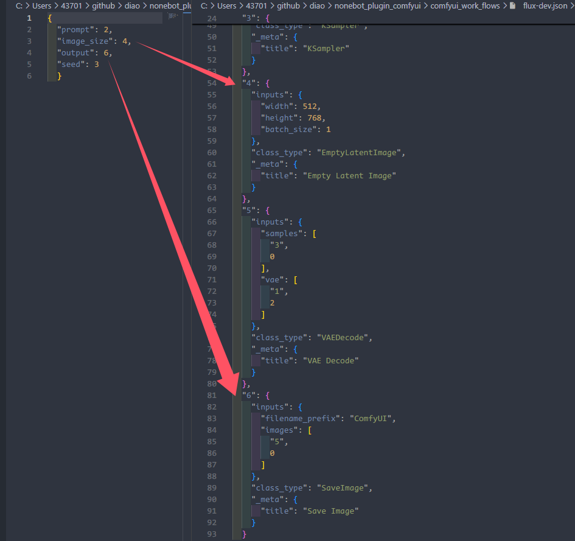

---

## 快速开始

### 什么是 Reflex 配置文件？

**Reflex 配置文件**是本插件的核心，它定义了哪些节点可以被动态覆写。配置文件需要：

- 名称格式：`工作流名称_reflex.json`
- 放置位置：与工作流 JSON 文件放在同一目录（默认为 `./data/comfyui/`）

### 创建第一个 Reflex 配置文件

假设你有一个名为 `my_txt2img.json` 的工作流文件，需要创建一个 `my_txt2img_reflex.json` 配置文件：

```json
{
  "output": 9,
  "sampler": 3,
  "image_size": 5,
  "prompt": 6,
  "negative_prompt": 7,
  "command": "绘画",
  "note": "基础 SDXL 文生图工作流"
}
```

### 配置文件说明

- **键（Key）**：覆写节点名称（如 `output`、`sampler`、`prompt` 等）
- **值（Value）**：对应 ComfyUI 导出的 JSON 文件中节点的 ID（整数）

例如，如果 ComfyUI 导出的 JSON 中，Save Image 节点的 ID 是 `9`，则配置中应写 `"output": 9`。

### 最简单的配置示例

最小配置只需要指定 `output` 节点：

```json
{
  "output": 94
}
```

虽然只配置了 `output` 节点也能工作，但这样你就无法通过参数控制工作流内的其他参数（如分辨率、步数等）。

### 多节点配置示例

```json
{
  "prompt": 32,
  "output": 94,
  "load_image": 3,
  "negative_prompt": 7
}
```

### 覆写多个相同类型的节点

```json
{
  "prompt": [114, 514],
  "output": 72,
  "sampler": 52,
  "seed": 52
}
```

上面的配置中，`prompt` 覆写了节点 114 和 514，这意味着这两个节点都会被用户输入的提示词更新。

> 💡 **学习建议**：插件第一次启动时会创建一些默认工作流（默认路径：`机器人目录/data/comfyui`），建议结合默认工作流和本文档进行学习。

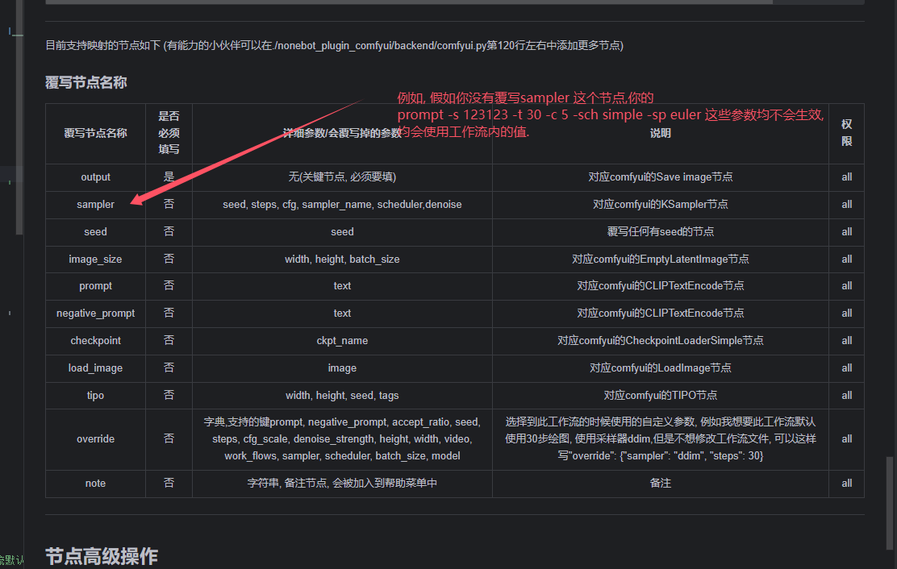

---

## 覆写节点详解

### 覆写节点速查表

| 覆写节点名称 | 是否必须 | 覆写的参数 | 对应 ComfyUI 节点 | 权限 |
|:-----------:|:------:|:---------:|:---------------:|:---:|
| `output` | ✅ **是** | 无（关键节点） | Save Image / Preview Image | all |
| `sampler` | 否 | seed, steps, cfg, sampler_name, scheduler, denoise | KSampler | all |
| `seed` | 否 | seed | 任何有 seed 的节点 | all |
| `image_size` | 否 | width, height, batch_size | EmptyLatentImage | all |
| `prompt` | 否 | text（正面提示词） | CLIPTextEncode | all |
| `negative_prompt` | 否 | text（负面提示词） | CLIPTextEncode | all |
| `checkpoint` | 否 | ckpt_name | CheckpointLoaderSimple | all |
| `load_image` | 否 | image | LoadImage | all |
| `tipo` | 否 | width, height, seed, tags | TIPO | all |
| `override` | 否 | 字典，支持多个键（见下文） | 工作流默认参数 | all |
| `note` | 否 | 字符串，工作流备注 | - | all |
| `media` | 否 | 字符串（image/video/text） | 标记输出类型 | all |
| `command` | 否 | 字符串，注册为命令 | - | all |
| `reg_args` | 否 | 字典，为命令添加自定义参数 | - | all |
| `available` | 否 | 列表，指定可用后端 | - | all |
| `daylimit` | 否 | 整数，每日调用次数限制 | - | all |
| `reflex` | 否 | 字典，后端特定节点值 | - | all |
| `admin` | 否 | 布尔，仅管理员可用 | - | all |
| `group` | 否 | 列表，仅指定群可用 | - | all |

### 节点高级操作速查表

| 覆写操作 | 需要额外参数 | 参数说明 | 说明 |
|:-------:|:---------:|:-------:|:---:|
| `randint` | 否 | - | 随机生成一个整数 |
| `append_prompt` | 否 | - | 将工作流中自带的正面提示词添加到输入中 |
| `append_negative_prompt` | 否 | - | 将工作流中自带的负面提示词添加到输入中 |
| `replace_prompt` | 否 | - | 将输入提示词替换到工作流中的 `{prompt}` 中 |
| `replace_negative_prompt` | 否 | - | 将输入负面提示词替换到工作流中的 `{prompt}` 中 |
| `upscale` | 是 | `upscale_1.5` | 对数字进行乘算，数字为倍率 |
| `value` | 是 | `value_你的值_值的类型` | 固定工作流中的数值（优先级最高） |
| `image` | 是 | `image_0` | 适用于需要加载多个图片的工作流 |

---

### 详细节点说明

#### output（必须）

**作用**：指定输出节点，插件必须通过此节点获取生成结果。

**支持的节点类型**：
- Save Image 节点
- Preview Image 节点
- Show Text 节点（文字输出）
- Video 节点（视频输出）

**基础配置**：

```json
{
  "output": 9
}
```

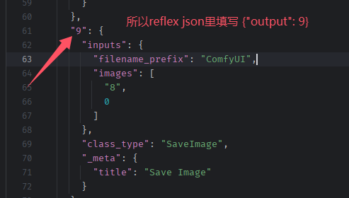 
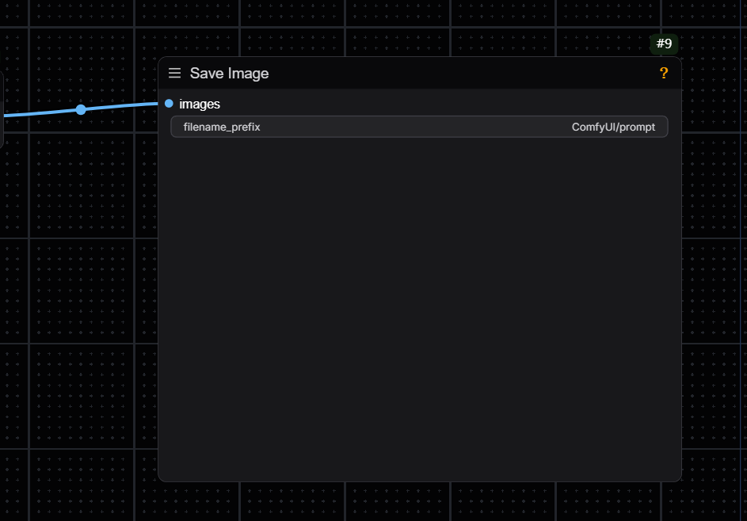

**混合输出模式**：

可以同时输出多种类型的媒体（图片、文字、视频）：

```json
{
  "output": {
    "image": [31, 32],
    "text": [33],
    "video": [34]
  }
}
```

说明：
- 节点 31 和 32 是图片输出节点（Save Image 或 Preview Image）
- 节点 33 是文字输出节点
- 节点 34 是视频输出节点
- 机器人会同时输出 2 张图片、1 段文字、1 段视频

#### sampler

**作用**：控制采样器相关参数，包括 seed、steps、cfg、sampler_name、scheduler、denoise。

**对应节点**：ComfyUI 的 KSampler 节点

**配置示例**：

```json
{
  "sampler": 9
}
```

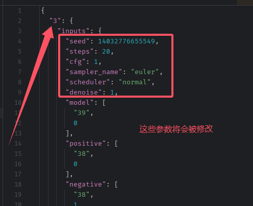
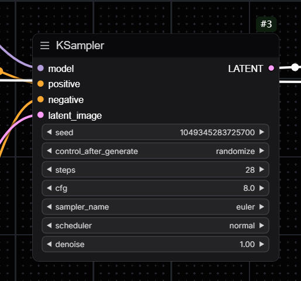

#### seed

**作用**：覆写节点中的 seed / noise_seed 参数。

**注意**：如果你发现生成的图片一直是同一张，很可能是没有覆写 seed 节点。

**配置示例**：

```json
{
  "seed": 9
}
```

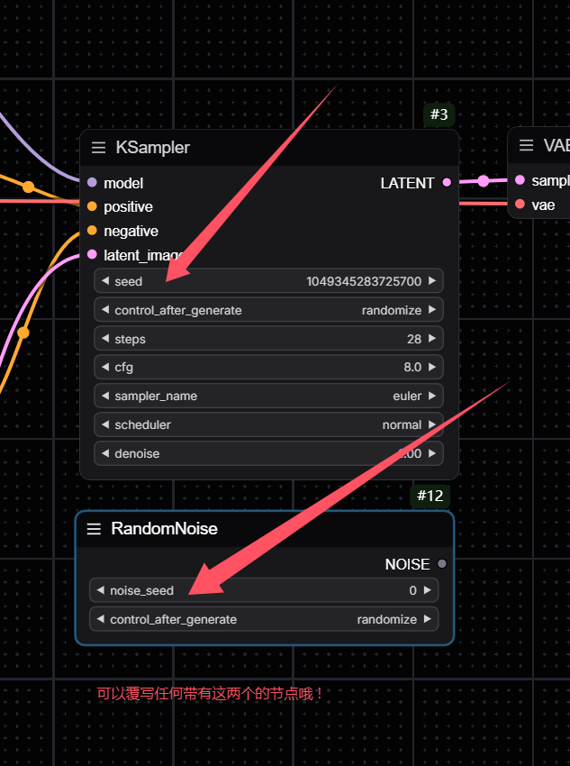


#### image_size

**作用**：控制图片尺寸和批次数量，对应 ComfyUI 的 EmptyLatentImage 节点。

**控制的参数**：width（宽度）、height（高度）、batch_size（每批张数）

**配置示例**：

```json
{
  "image_size": 4
}
```

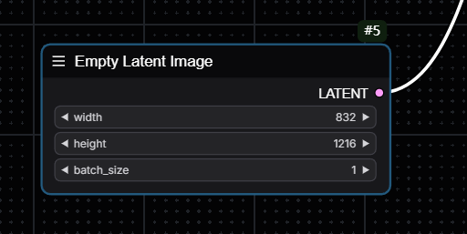
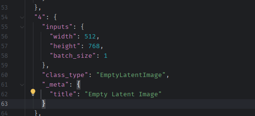

#### prompt / negative_prompt

**作用**：控制正面提示词和负面提示词，可以是任何需要输入 text 的节点。

**对应节点**：CLIPTextEncode 节点或其他文本输入节点

**配置示例**：

```json
{
  "prompt": 6,
  "negative_prompt": 7
}
```

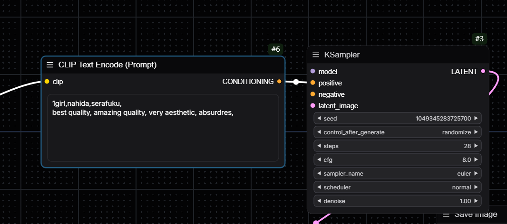
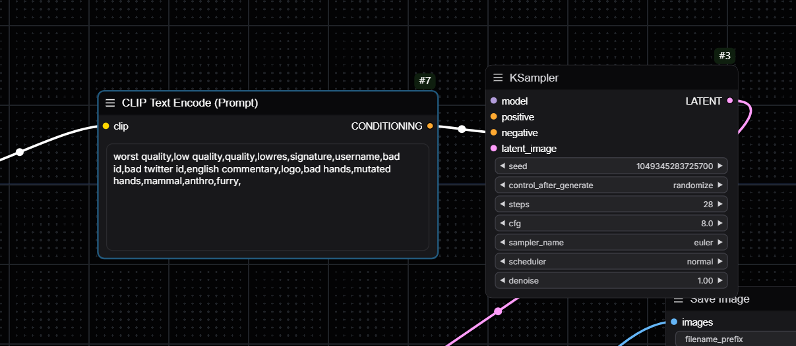
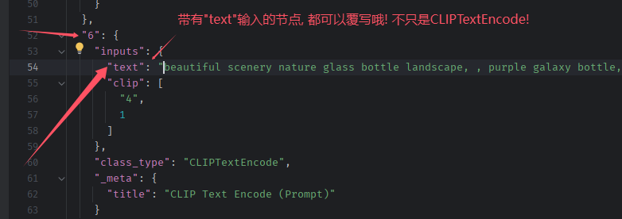

#### checkpoint

**作用**：控制模型选择，对应 ComfyUI 的 CheckpointLoaderSimple 节点。

**配置后**：可以使用 `-m` 参数来指定模型。

**配置示例**：

```json
{
  "checkpoint": 45
}
```

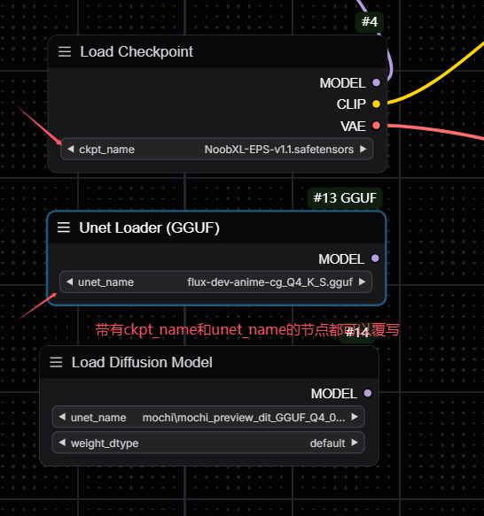
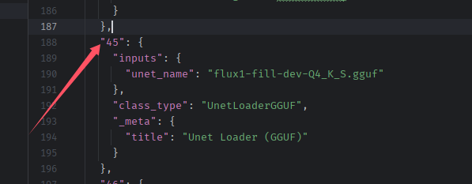

#### load_image

**作用**：加载图像节点，对应 ComfyUI 的 LoadImage 节点。

**配置示例**：

```json
{
  "load_image": 17
}
```

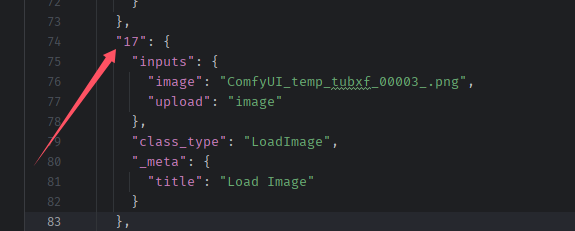
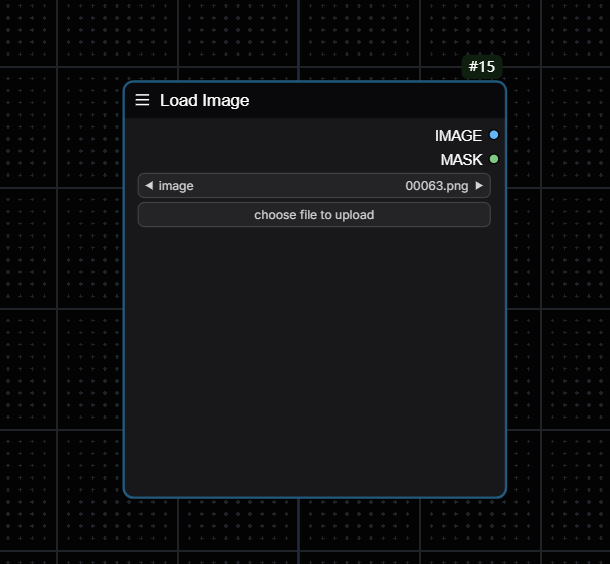

#### override

**作用**：为工作流设置默认参数，在工作流被调用时自动应用这些参数。

**支持的参数键**：
- `prompt`：提示词
- `negative_prompt`：负面提示词
- `accept_ratio`：画幅比例（如 "2:1"）
- `seed`：种子
- `steps`：迭代步数
- `cfg_scale`：CFG 值
- `denoise_strength`：降噪强度
- `height`：图像高度
- `width`：图像宽度
- `work_flows`：选择的工作流
- `sampler`：采样器
- `scheduler`：调度器
- `batch_size`：每批次数量
- `batch_count`：总批次
- `model`：模型
- `override`：不使用内置正面提示词
- `override_ng`：不使用内置负面提示词
- `forward`：转发消息
- `concurrency`：并发
- `shape`：默认分辨率（如 "832x1216"）
- `silent`：静默生图
- `notice`：执行完成后通知
- `no_trans`：不翻译提示词

**配置示例**：

```json
{
  "override": {
    "prompt": "",
    "negative_prompt": "",
    "accept_ratio": "2:1",
    "seed": 123456,
    "steps": 35,
    "cfg_scale": 7.5,
    "denoise_strength": 0.7,
    "height": 512,
    "width": 768,
    "work_flows": "default",
    "sampler": "Euler a",
    "scheduler": "normal",
    "batch_size": 1,
    "batch_count": 1,
    "model": "stable-diffusion-v1-5.ckpt",
    "override": false,
    "override_ng": false,
    "forward": false,
    "concurrency": false,
    "shape": "832x1216",
    "silent": false,
    "notice": false,
    "no_trans": false
  }
}
```

**优先级说明**：
- 使用此工作流时，会默认使用以上参数
- 如果手动指定参数，手动参数优先级更高
- 例如：`prompt nahida` 会使用默认参数（steps: 35, cfg_scale: 7.5）
- 但 `prompt nahida --steps 28` 会覆盖 steps 参数，最终使用 steps: 28

#### note

**作用**：为工作流添加备注说明，会在查看工作流命令中显示。

**配置示例**：

```json
{
  "note": "这是一个基础工作流"
}
```

#### media

**作用**：标记此工作流的输出类型（image/text/video），不填写则默认为图片。

**注意**：不推荐单独使用，建议使用上面 `output` 节点提到的混合输出模式。

**配置示例**：

```json
{
  "media": "text"
}
```

例如一个打标工作流：

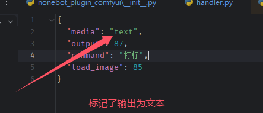

#### command

**作用**：将工作流注册为命令，注册后可以通过命令名直接调用该工作流。

**配置示例（单个命令名）**：

```json
{
  "media": "text",
  "output": 87,
  "command": "打标",
  "load_image": 85
}
```

**配置示例（多个别名）**：

```json
{
  "media": "text",
  "output": 87,
  "command": ["打标", "tagger", "分析"],
  "load_image": 85
}
```

**说明**：
- 注册为命令后，其他参数依然生效
- 例如：`打标 --steps 28` 这样的命令也是有效的
- 命令名可以不和工作流名称相同


#### reg_args（高级功能）

**作用**：为注册的命令添加自定义参数，允许通过命令行参数控制工作流中的特定节点参数。

**适用场景**：当你想要控制某个参数，但默认的节点覆写没有提供时。

**注意事项**：
- `type` 使用 Python 的数据类型（int, str, float, bool 等）

**配置示例（扩图工作流）**：

```json
{
  "load_image": 17,
  "output": 9,
  "command": "扩图",
  "note": "flux-fill扩图, 建议扩图分辨率不要超过200",
  "reg_args": {
    "44": {
      "args": [
        {
          "name_or_flags": ["-opl"],
          "type": "int",
          "dest": "left_unique",
          "help": "向左扩图",
          "default": 0,
          "dest_to_value": {"left_unique": "left"}
        },
        {
          "name_or_flags": ["-opr"],
          "type": "int",
          "dest": "right",
          "help": "向右扩图",
          "default": 0
        },
        {
          "name_or_flags": ["-opt"],
          "type": "int",
          "dest": "top",
          "help": "向上扩图",
          "default": 128
        },
        {
          "name_or_flags": ["-opb"],
          "type": "int",
          "dest": "bottom",
          "help": "向下扩图",
          "default": 128
        },
        {
          "name_or_flags": ["-ft"],
          "type": "int",
          "dest": "feathering",
          "help": "羽化半径",
          "default": 30
        }
      ]
    }
  }
}
```

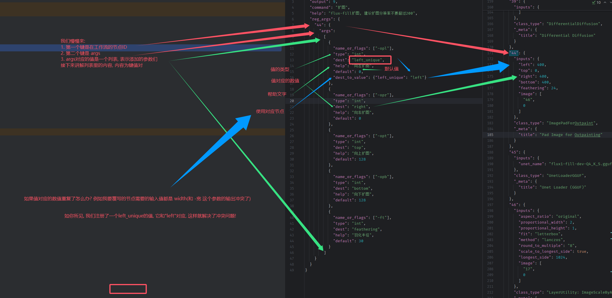


**自定义预设参数**：

为了方便自定义参数，插件支持预设参数映射功能：

```json
{
  "reg_args": {
    "21": {
      "args": [
        {
          "name_or_flags": ["-cn"],
          "type": "float",
          "dest": "strength",
          "help": "控制强度",
          "default": 0.8,
          "preset": {
            "default": 0.8,
            "low": 0.5,
            "mid": 0.8,
            "high": 1.0
          }
        }
      ]
    }
  }
}
```

使用示例：`-cn low` 会将控制强度设定为 0.5。

#### available

**作用**：在多后端工作模式中，指定此工作流可以在哪些后端执行。

**使用场景**：
- 某些工作流需要的模型只存在于特定后端
- 当能执行此工作流的后端不在线时，会抛出异常提醒
- 当手动选择不能执行此工作流的后端时，会自动切换到能执行的后端

**配置示例**：

```json
{
  "available": [0, 1]
}
```

**说明**：
- 如果你的 `comfyui_url_list` 为：
  ```
  [
    "http://127.0.0.1:8188",
    "http://127.0.0.1:8288",
    "http://127.0.0.1:8388"
  ]
  ```
- 那么：
  - 0 号后端 = `http://127.0.0.1:8188`
  - 1 号后端 = `http://127.0.0.1:8288`
  - 2 号后端 = `http://127.0.0.1:8388`
- 此工作流只能在 0 号和 1 号后端执行

#### daylimit

**作用**：限制工作流每天可以调用的次数。

**适用场景**：某些工作流消耗时间太长，为了避免用户频繁调用。

**配置示例**：

```json
{
  "daylimit": 2
}
```

说明：此工作流每天只能调用 2 次。

#### reflex

**作用**：在多后端工作模式中，为不同后端指定不同的节点参数值。

**使用场景**：
- 不同后端可能拥有相同功能但名称不同的模型
- 例如：1 号后端有 `noob1.safetensors`，2 号后端有 `noob_eps_1.safetensors`
- 它们实际是同一个模型，但使用 API JSON 请求时会报错找不到模型

**配置示例**：

```json
{
  "reflex": {
    "0": {
      "4": {
        "ckpt_name": "NoobXL-EPS-v1.1.safetensors"
      }
    }
  }
}
```

说明：当此工作流请求到 0 号后端时，为 4 号节点的 `ckpt_name` 参数应用 `NoobXL-EPS-v1.1.safetensors`。

#### lora（自动加载）

**作用**：配合 `comfyui_auto_lora` 使用，自动加载 LoRA 模型。

**注意事项**：
- 使用此功能时，节点 ID 会累加（第一个 LoRA #11，第二个 #12，以此类推）
- 如果和其他节点 ID 冲突会报错，建议将节点 ID 设置得较大一些
- 只有当 `comfyui_auto_lora` 启动时，此功能才有效

**方式一：工作流已有 LoRA 加载节点**

```json
{
  "lora": 11
}
```

使用：`prompt "<lora:nikki:1.1>, <lora:chenbin:1.1>"` 会自动加载 nikki 和 chenbin LoRA 模型。

**方式二：工作流没有 LoRA 加载节点**

导出工作流时**不需要**包含 LoRA 加载节点，配置如下：

```json
{
  "lora": [
    {
      "11": {
        "from": {
          "model": 4,
          "clip": 4
        },
        "to": {
          "model": [3],
          "clip": [6, 7]
        }
      }
    }
  ]
}
```

说明：手动分配节点 ID 11，并指定连接关系。

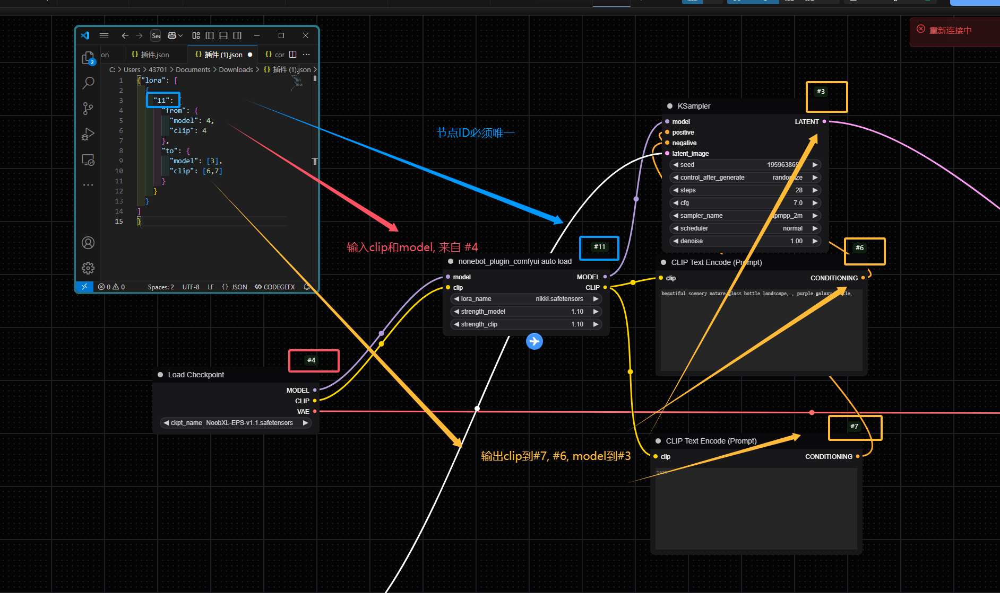

#### admin

**作用**：限制工作流只能被管理员用户使用。

**配置示例**：

```json
{
  "admin": true
}
```

#### group

**作用**：限制工作流只能在指定的群组中使用。

**配置示例**：

```json
{
  "group": [114514, 200224]
}
```

说明：只有在群 114514 和 200224 中才能使用此工作流。

---

## 高级节点覆写操作

高级节点覆写操作允许你对节点的特定参数进行更精细的控制。

### 覆写格式说明

**基础格式**（覆写单个节点）：

```json
{
  "节点类型": 节点ID
}
```

**覆写多个节点**：

```json
{
  "节点类型": [节点ID1, 节点ID2]
}
```

**高级覆写格式**（对节点参数进行特殊操作）：

```json
{
  "节点类型": {
    "节点ID": {
      "override": {
        "参数名": "操作"
      }
    }
  }
}
```

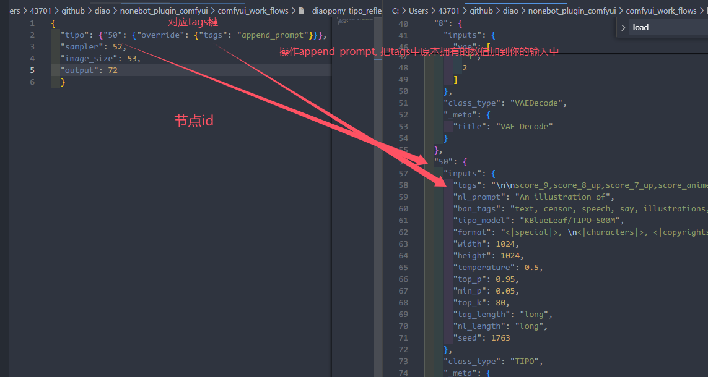

### append_prompt / append_negative_prompt

**作用**：将工作流 JSON 文件中本身带有的提示词/负面提示词加入到用户输入的提示词中。

**配置示例**：

```json
{
  "prompt": {
    "83": {
      "override": {
        "text": "append_prompt"
      }
    }
  },
  "negative_prompt": {
    "7": {
      "override": {
        "text": "append_negative_prompt"
      }
    }
  },
  "output": 85
}
```

**复杂示例**（覆写多个节点）：

```json
{
  "prompt": {
    "399": {
      "override": {
        "text": "append_prompt"
      }
    }
  },
  "negative_prompt": {
    "400": {
      "override": {
        "text": "append_negative_prompt"
      }
    }
  },
  "seed": [291, 127, 276],
  "image_size": {
    "395": {},
    "292": {
      "override": {
        "width": "upscale_0.75",
        "height": "upscale_0.75"
      }
    }
  },
  "output": 458
}
```

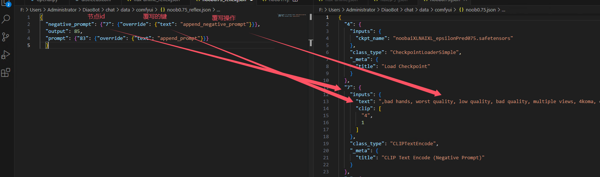


### replace_prompt / replace_negative_prompt

**作用**：将用户输入的提示词替换到工作流 JSON 文件中的 `{prompt}` 占位符中。

**配置示例**：

```json
{
  "prompt": {
    "25": {
      "override": {
        "text": "replace_prompt"
      }
    }
  }
}
```

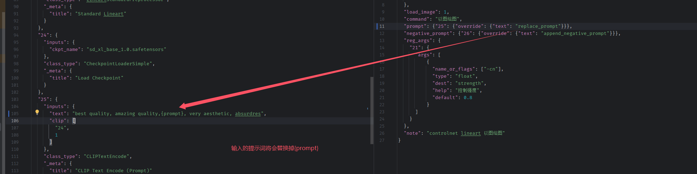

### image（多图片输入）

**作用**：适用于需要输入多个图片的工作流，为不同的 LoadImage 节点分配不同的图片。

**配置示例**：

```json
{
  "image": {
    "50": {
      "override": {
        "image": "image_0"
      }
    },
    "52": {
      "override": {
        "image": "image_1"
      }
    }
  }
}
```

说明：
- 节点 50 使用第一张上传的图片
- 节点 52 使用第二张上传的图片

---

## 完整配置示例

### 基础文生图工作流

```json
{
  "output": 9,
  "sampler": 3,
  "image_size": 5,
  "prompt": 6,
  "negative_prompt": 7,
  "command": "绘画",
  "note": "基础 SDXL 文生图工作流"
}
```

### 以图生图工作流

```json
{
  "prompt": 32,
  "output": 94,
  "load_image": 3,
  "negative_prompt": 7
}
```

### 复杂工作流（包含多个相同类型节点）

```json
{
  "tipo": 50,
  "sampler": 52,
  "seed": 52,
  "image_size": 53,
  "output": 72
}
```

### 使用 override 设置默认参数

```json
{
  "prompt": [114, 514],
  "output": 72,
  "override": {
    "sampler": "ddim",
    "steps": 30
  },
  "note": "文生图工作流"
}
```

说明：选择此工作流时，默认使用 ddim 采样器和 30 步，但可以通过命令行参数覆盖。

---

## 常见问题

### Q: 为什么生成的图片一直是同一张？

A: 很可能是没有覆写 `seed` 节点。添加 `"seed": 节点ID` 到配置文件中。

### Q: 必须配置所有节点吗？

A: 不是。只有 `output` 节点是必须的，其他节点根据你的需求选择性地配置。如果不配置某个节点，就无法通过命令行参数控制该节点的参数。

### Q: 如何找到节点的 ID？

A: 在 ComfyUI 导出的 JSON 文件中，每个节点都有一个数字 ID。在 ComfyUI 界面中，也可以看到节点的 ID。

### Q: 覆写的优先级是什么？

A: 命令行参数 > override 默认参数 > 工作流 JSON 中的原始参数。

---

**提示**：更多示例请参考仓库内的 `comfyui_work_flows` 目录和插件默认生成的工作流文件。
