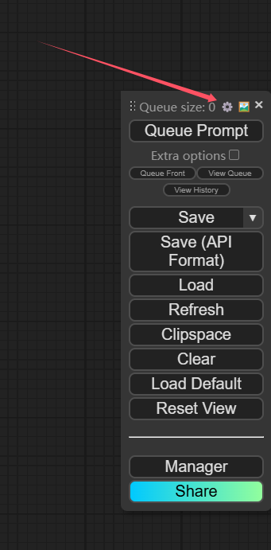

# 本插件提供了详细的控制节点输入的功能

## 为什么需要这个功能?
## 答: 因为comfyui的工作流导出的时候, 使用的参数固定死了(比如种子, 分辨率, 步数等等), 本功能就可以选择哪些参数进行定制化(例如重新输入分辨率等等)
***
## 在开始之前, 准备API格式的JSON文件
### 首先,本插件必须要有一个Save Image节点来输出

### 之后, 导出API格式的JSON工作流文件
  
  
  
***
## 创建一个json文件, 名称和工作流名称一致, 并且加上_reflex, 把它们一起放在./data/comfyui(你设置的工作流路径内)
比如说你有一个工作流叫做my_txt2img.json 
你需要创建一个my_txt2img_reflex.json文件, 内容如下
### 键为: 请看表 覆写节点名称 , 值为comfyui导出的json文件中对应的节点ID
### ⚠️⚠️⚠️!注意看图! 关键是output, 连接到了SaveImage节点, 这个是必须的️⚠️⚠️


### ️⚠️⚠️其他的节点都可以不覆写, 但是你就无法通过参数来控制工作流内的参数 ️⚠️⚠️️⚠️

```
{
"prompt": 32,
"output": 94,  # 必须要!
"load_image": 3,
"negative_prompt": 7
}
----第二个例子-----
{
"tipo": 50,
"sampler": 52,  # sampler节点
"seed": 52  # 只替换sampler节点中的seed参数
"image_size": 53,
"output": 72,
  }
```
### 接下来为高级节点控制, 请观察以下
### 覆写的意思是, prompt -t 30 , 这里的步数30步, 覆写到comfyui的API json中, 因为api json中的值是固定的
```
{
# 覆写多个节点
"prompt": [114, 514]  # 为节点114, 和 514 添加覆写
"override": {"sampler": "ddim", "steps": 30}  # 选择到此工作流的时候使用的自定义参数, 例如我想要此工作流默认使用30步绘图, 使用采样器ddim,但是不想修改工作流文件
"note": "文生图工作流"  # 仅用作备注
}
```
### 高级节点控制 / 可以同时覆写多个节点
### 格式为: 节点ID: {"override": {"comfyui api json 中的键": "操作(请看下面的表-节点高级操作)"}} ↓请看图
  
```
"prompt": {"50": {"override": {"text": "append_prompt"}}, "52": {"override": {"text": "append_prompt"}}}  # 覆写节点id为52的节点, 键为text, 操作为把api json文件中的text的值加到正面提示词中
# 需要输入多个图片的工作流
"image": {"50": {"override": {"image": "image_0"}}, "52": {"override": {"image": "image_1"}}}  # 为50节点选择第一张图片, 52节点第二张
```
****
目前支持映射的节点如下 (有能力的小伙伴可以在./nonebot_plugin_comfyui/backend/comfyui.py第120行左右中添加更多节点)
### 覆写节点名称

|     覆写节点名称      | 是否必须填写 |                                                                          详细参数/会覆写掉的参数                                                                           |                                                        说明                                                        |权限|
|:---------------:|:------:|:---------------------------------------------------------------------------------------------------------------------------------------------------------------:|:----------------------------------------------------------------------------------------------------------------:|:---:|
|     output      |   是    |                                                                          无(关键节点, 必须要填)                                                                          |                                              对应comfyui的Save image节点                                              |all|
|     sampler     |   否    |                                                        seed, steps, cfg, sampler_name, scheduler,denoise                                                        |                                               对应comfyui的KSampler节点                                               |all|
|      seed       |   否    |                                                                              seed                                                                               |                                                   覆写任何有seed的节点                                                   |all|
|   image_size    |   否    |                                                                    width, height, batch_size                                                                    |                                           对应comfyui的EmptyLatentImage节点                                           |all|
|     prompt      |   否    |                                                                         text  (覆写正面提示词)                                                                         |                                            对应comfyui的CLIPTextEncode节点                                            |all|
| negative_prompt |   否    |                                                                        text   (覆写负面提示词)                                                                         |                                            对应comfyui的CLIPTextEncode节点                                            |all|
|   checkpoint    |   否    |                                                                            ckpt_name                                                                            |                                        对应comfyui的CheckpointLoaderSimple节点                                        |all|
|   load_image    |   否    |                                                                              image                                                                              |                                              对应comfyui的LoadImage节点                                               |all|
|      tipo       |   否    |                                                                    width, height, seed, tags                                                                    |                                                 对应comfyui的TIPO节点                                                 |all|
|    override     |   否    | 字典,支持的键prompt, negative_prompt, accept_ratio, seed, steps, cfg_scale, denoise_strength, height, width, video, work_flows, sampler, scheduler, batch_size, model | 选择到此工作流的时候使用的自定义参数, 例如我想要此工作流默认使用30步绘图, 使用采样器ddim,但是不想修改工作流文件, 可以这样写"override": {"sampler": "ddim", "steps": 30} |all|
|      note       |   否    |                                                                      字符串, 备注节点, 会被加入到帮助菜单中                                                                      |                                                        备注                                                        |all|
|      media      |   否    |                                                          字符串, 暂时支持image, video, text,"media": "video"                                                           |                                               字符串, 标记这条工作流的输出是什么类型                                               |all|
|     command     |   否    |                                                              该工作流的名称会被注册为命令  ,"command": "tagger"                                                               |                  例如工作流名叫 tagger, 添加此覆写之后, 使用 tagger 命令即可自动调用此节点(可以不和工作流名称相同哦!你的命令不一定要是tagger!)                   |all|
****
## 节点高级操作
|   覆写操作    | 需要额外参数 |              参数说明               |         说明          |权限|
|:---------:|:------:|:-------------------------------:|:-------------------:|:---:|
|  randint   |   否    |                /                |      随机生成一个整数       |all|
| append_prompt |   否    |                /                | 将工作流中自带的正面提示词添加到输入中 |all|
|   append_negative_prompt   |   否    |                /                | 将工作流中自带的负面提示词添加到输入中 |all|
|   upscale   |   是    |           upscale_1.5           |   对数字进行乘算, 数字为倍率    |all|
|   value   |   是    | value_你的值_值的类型(int, str, float) |  固定工作流中的数值(优先级最高)   |all|
|   image   |   是    |             image_0             |   适用于需要加载多个图片的工作流   |all|
****
## 还请你阅读仓库内的comfyui_work_flows来学习基本使用